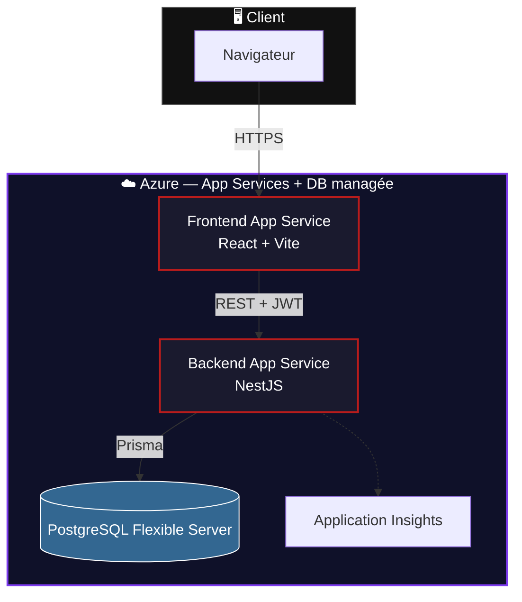
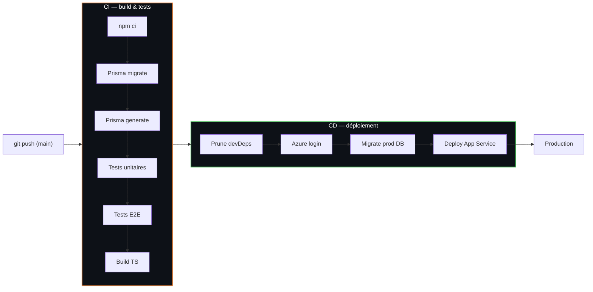
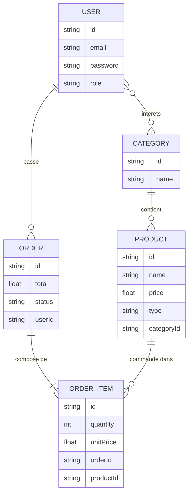
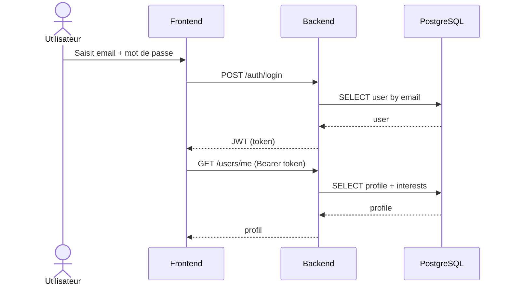
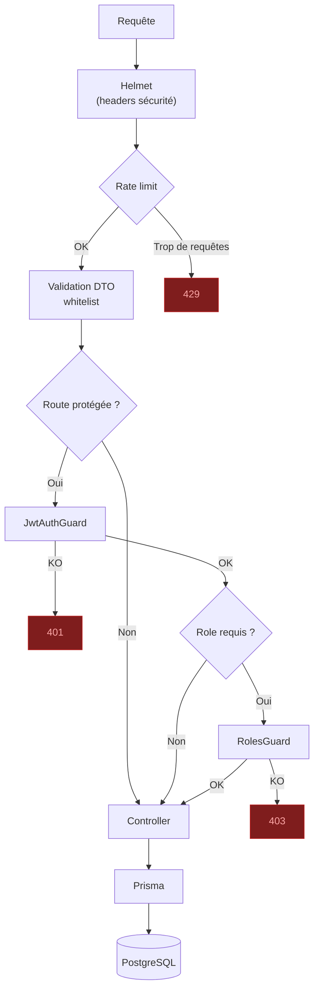

# 3. Schémas Mermaid (rapport)

## 3.1 Architecture globale

```mermaid
graph TB
  subgraph CLIENT["🖥️ Client"]
    BROWSER["Navigateur"]
  end

  subgraph AZURE["☁️ Azure — App Services + DB managée"]
    FE["Frontend App Service\nReact + Vite"]
    BE["Backend App Service\nNestJS"]
    DB[("PostgreSQL Flexible Server")]
    INSIGHTS["Application Insights"]
  end

  BROWSER -->|HTTPS| FE
  FE -->|REST + JWT| BE
  BE -->|Prisma| DB
  BE -.-> INSIGHTS

  style AZURE fill:#0f1129,stroke:#7c3aed,stroke-width:2px,color:#fff
  style FE fill:#1a1a2e,stroke:#b91c1c,stroke-width:2px,color:#fff
  style BE fill:#1a1a2e,stroke:#b91c1c,stroke-width:2px,color:#fff
  style DB fill:#336791,stroke:#fff,color:#fff
  style CLIENT fill:#111,stroke:#555,color:#fff
```

## 3.2 CI/CD (quality gates)

```mermaid
graph LR
  PUSH["git push (main)"] --> CI

  subgraph CI["CI — build & tests"]
    I["npm ci"] --> M["Prisma migrate"] --> G["Prisma generate"]
    G --> U["Tests unitaires"] --> E["Tests E2E"] --> B["Build TS"]
  end

  CI --> CD

  subgraph CD["CD — déploiement"]
    P["Prune devDeps"] --> L["Azure login"] --> MP["Migrate prod DB"] --> D["Deploy App Service"]
  end

  D --> PROD["Production"]

  style CI fill:#0d1117,stroke:#f0883e,stroke-width:2px,color:#fff
  style CD fill:#0d1117,stroke:#3fb950,stroke-width:2px,color:#fff
```

## 3.3 Modèle de données (ER)

```mermaid
erDiagram
  USER ||--o{ ORDER : "passe"
  USER }o--o{ CATEGORY : "interets"
  CATEGORY ||--o{ PRODUCT : "contient"
  ORDER ||--|{ ORDER_ITEM : "compose de"
  PRODUCT ||--o{ ORDER_ITEM : "commande dans"

  USER {
    string id
    string email
    string password
    string role
  }
  CATEGORY {
    string id
    string name
  }
  PRODUCT {
    string id
    string name
    float price
    string type
    string categoryId
  }
  ORDER {
    string id
    float total
    string status
    string userId
  }
  ORDER_ITEM {
    string id
    int quantity
    float unitPrice
    string orderId
    string productId
  }
```

## 3.4 Auth (séquence)

```mermaid
sequenceDiagram
  actor U as Utilisateur
  participant F as Frontend
  participant B as Backend
  participant DB as PostgreSQL

  U->>F: Saisit email + mot de passe
  F->>B: POST /auth/login
  B->>DB: SELECT user by email
  DB-->>B: user
  B-->>F: JWT (token)
  F->>B: GET /users/me (Bearer token)
  B->>DB: SELECT profile + interests
  DB-->>B: profile
  B-->>F: profil
```

## 3.5 Chaîne de contrôles sécurité (runtime)

```mermaid
graph TB
  REQ["Requête"] --> H["Helmet\n(headers sécurité)"]
  H --> T{"Rate limit"}
  T -->|OK| V["Validation DTO\nwhitelist"]
  T -->|Trop de requêtes| R429["429"]
  V --> A{"Route protégée ?"}
  A -->|Non| C["Controller"]
  A -->|Oui| J["JwtAuthGuard"]
  J -->|KO| R401["401"]
  J -->|OK| RB{"Role requis ?"}
  RB -->|Non| C
  RB -->|Oui| RG["RolesGuard"]
  RG -->|KO| R403["403"]
  RG -->|OK| C
  C --> P["Prisma"] --> DB[("PostgreSQL")]

  style R429 fill:#7f1d1d,stroke:#b91c1c,color:#fca5a5
  style R401 fill:#7f1d1d,stroke:#b91c1c,color:#fca5a5
  style R403 fill:#7f1d1d,stroke:#b91c1c,color:#fca5a5
```
