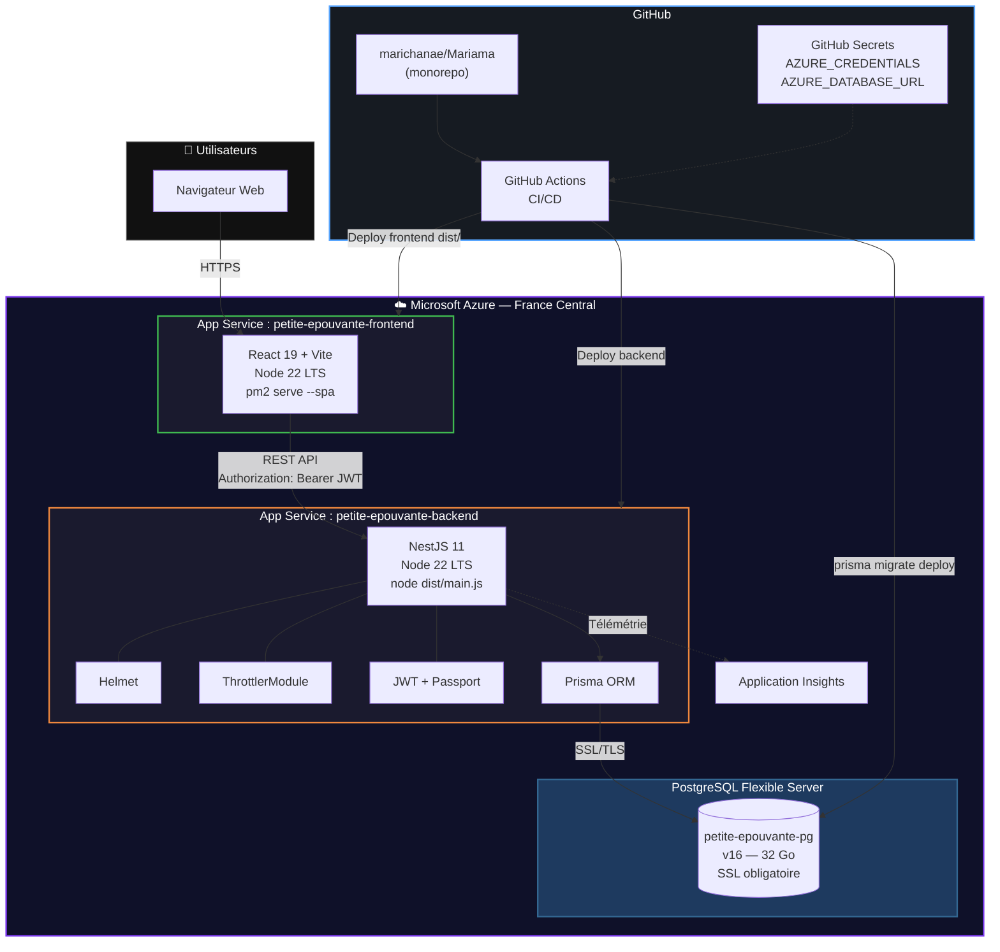
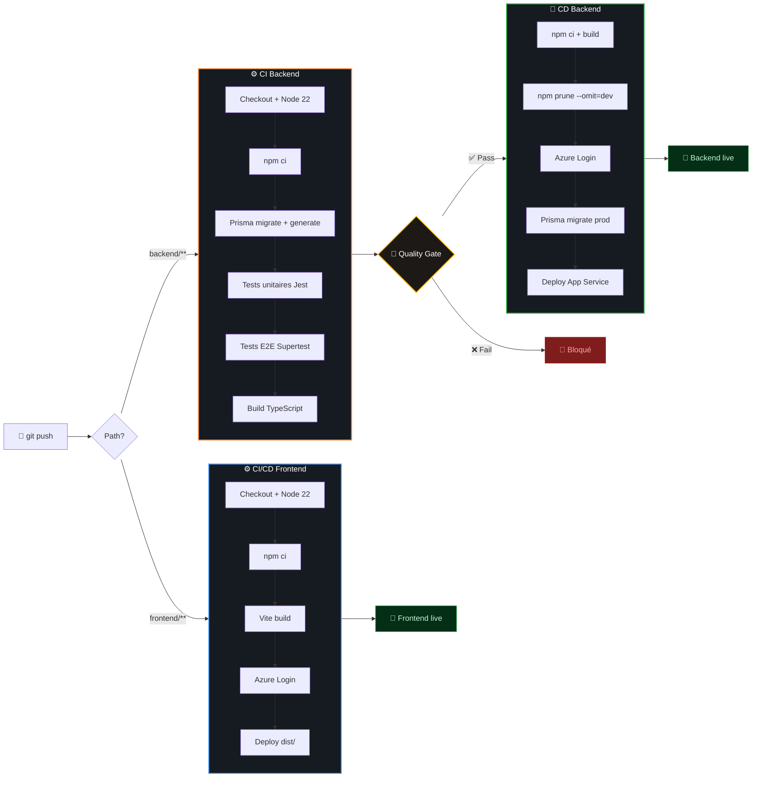
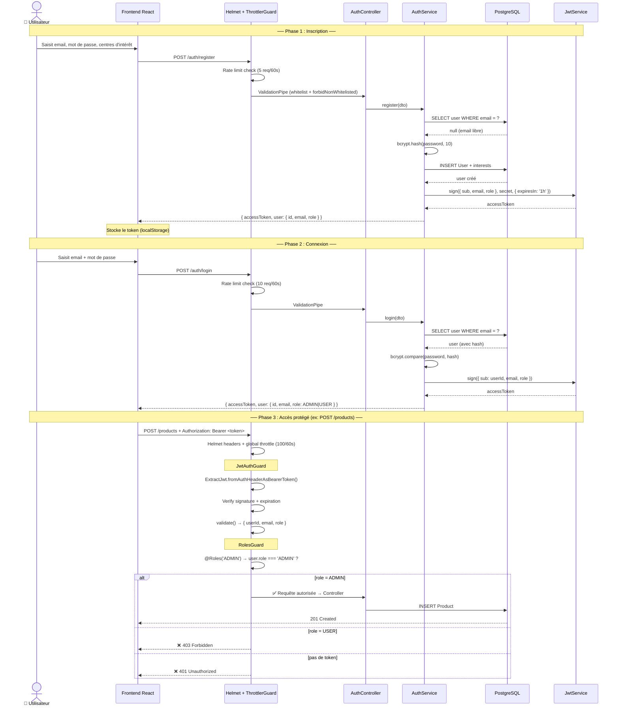
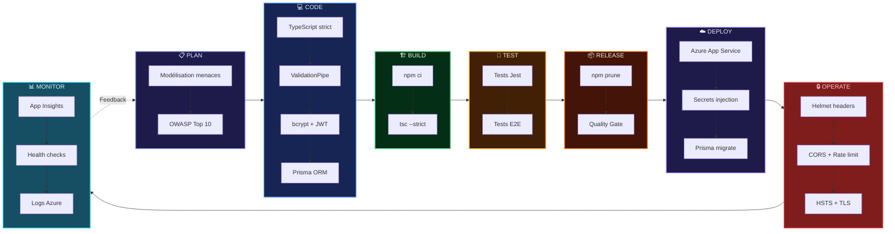
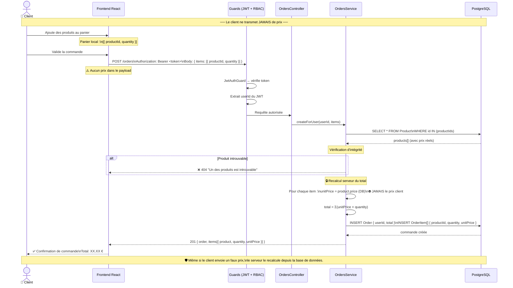
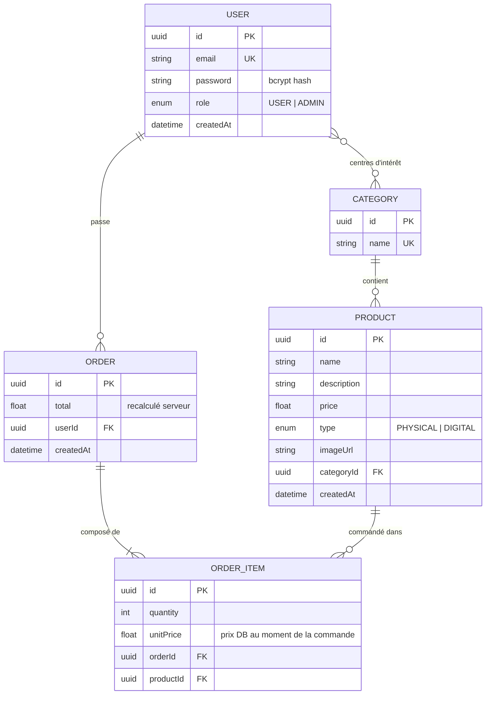

# Schémas Mermaid — La Petite Maison de l'Épouvante

> Diagrammes techniques pour le rapport. Tous les schémas sont fidèles au code source réel.

---

## 1. Architecture réelle du système

---

## 2. Pipeline CI/CD avec Quality Gates

---

## 3. Authentification JWT + RBAC

---

## 4. Cycle DevSecOps intégré

---

## 5. Sécurisation du Checkout (recalcul serveur)

---

## 6. Modèle de données (ER)

