# 3. Schémas Mermaid (rapport)

## 3.1 Architecture globale

## 3.2 CI/CD (quality gates)

## 3.3 Modèle de données (ER)

## 3.4 Auth (séquence)

## 3.5 Chaîne de contrôles sécurité (runtime)

```mermaid
graph TB
  REQ["Requête"] --> H["Helmet\n(headers sécurité)"]
  H --> T{"Rate limit"}
  T -->|OK| V["Validation DTO\nwhitelist"]
  T -->|Trop de requêtes| R429["429"]
  V --> A{"Route protégée ?"}
  A -->|Non| C["Controller"]
  A -->|Oui| J["JwtAuthGuard"]
  J -->|KO| R401["401"]
  J -->|OK| RB{"Role requis ?"}
  RB -->|Non| C
  RB -->|Oui| RG["RolesGuard"]
  RG -->|KO| R403["403"]
  RG -->|OK| C
  C --> P["Prisma"] --> DB[("PostgreSQL")]

  style R429 fill:#7f1d1d,stroke:#b91c1c,color:#fca5a5
  style R401 fill:#7f1d1d,stroke:#b91c1c,color:#fca5a5
  style R403 fill:#7f1d1d,stroke:#b91c1c,color:#fca5a5
```

## 3.6 Pipeline CI/CD (backend + frontend)

```mermaid
flowchart TB
  subgraph REPO["Repo GitHub (monorepo)"]
    PUSH["Push/PR sur main"]
  end

  subgraph BACK["Backend CI/CD — .github/workflows/backend-ci-cd.yml"]
    direction TB
    B1["CI: npm ci"] --> B2["CI: prisma migrate deploy (DB CI)"] --> B3["CI: prisma generate"]
    B3 --> B4["CI: tests unitaires (Jest)"] --> B5["CI: tests E2E (Jest + Supertest)\nPostgres service container"] --> B6["CI: build (tsc)"]
    B6 -->|Quality Gate OK| B7["CD: npm prune --omit=dev"] --> B8["CD: Azure login"] --> B9["CD: prisma migrate deploy (DB prod)"] --> B10["CD: deploy App Service backend"]
  end

  subgraph FRONT["Frontend CI/CD — .github/workflows/frontend-ci-cd.yml"]
    direction TB
    F1["CI: npm ci"] --> F2["CI: build (tsc + vite build)\nVITE_API_URL injecté"] --> F3["CD: Azure login"] --> F4["CD: deploy dist/ vers App Service frontend"]
  end

  subgraph PROD["Production Azure"]
    FE["Frontend live"]
    BE["Backend live"]
    HEALTH["GET /health"]
  end

  PUSH --> BACK
  PUSH --> FRONT
  B10 --> BE --> HEALTH
  F4 --> FE

  style BACK fill:#0d1117,stroke:#f0883e,stroke-width:2px,color:#fff
  style FRONT fill:#0d1117,stroke:#3fb950,stroke-width:2px,color:#fff
  style PROD fill:#0f1129,stroke:#7c3aed,stroke-width:2px,color:#fff
```

