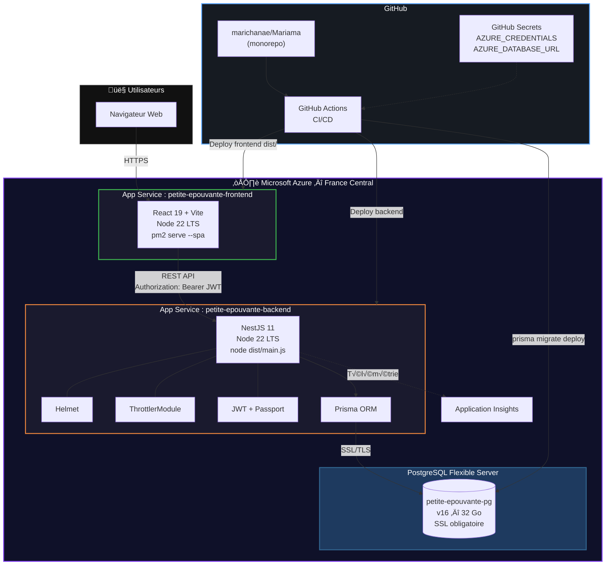
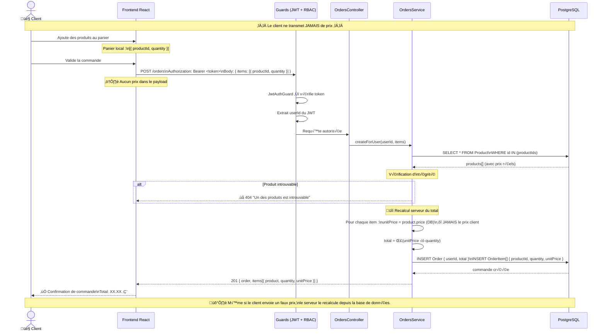

# Schémas Mermaid — La Petite Maison de l'Épouvante

> Diagrammes techniques pour le rapport. Tous les schémas sont fidèles au code source réel.

---

## 1. Architecture réelle du système

---

## 2. Pipeline CI/CD avec Quality Gates

```mermaid
flowchart LR
  PUSH["🔀 git push / PR\nsur main"] --> TRIGGER{"Path filter"}
  TRIGGER -->|"backend/**"| BACK_CI
  TRIGGER -->|"frontend/**"| FRONT_CI

  subgraph BACK_CI["⚙️ Backend CI — build-and-test"]
    direction LR
    BC1["📥 Checkout + Node 22"] --> BC2["📦 npm ci"]
    BC2 --> BC3["🗄️ Prisma migrate"]
    BC3 --> BC4["⚡ Prisma generate"]
    BC4 --> BC5["🧪 Tests Jest"]
    BC5 --> BC6["🧪 Tests E2E"]
    BC6 --> BC7["🏗️ Build TS"]
  end

  BC7 -->|"✅ Quality Gate"| GATE{"🚦 Gate"}
  GATE -->|"❌ Fail"| STOP["🛑 Bloqué"]
  GATE -->|"✅ Pass + main"| BACK_CD

  subgraph BACK_CD["🚀 Backend CD — deploy"]
    direction LR
    BD1["📦 npm ci + build"] --> BD2["✂️ prune"]
    BD2 --> BD3["🔐 Azure Login"]
    BD3 --> BD4["🗄️ Prisma migrate"]
    BD4 --> BD5["☁️ Deploy"]
  end

  subgraph FRONT_CI["⚙️ Frontend CI/CD — build-and-deploy"]
    direction LR
    FC1["📥 Checkout + Node 22"] --> FC2["📦 npm ci"]
    FC2 --> FC3["🏗️ Vite build"]
    FC3 --> FC4["🔐 Azure Login"]
    FC4 --> FC5["☁️ Deploy"]
  end

  BD5 --> HEALTH["💚 /health OK"]
  FC5 --> LIVE["🌐 Frontend live"]

  style BACK_CI fill:#161b22,stroke:#f0883e,stroke-width:2px,color:#fff
  style BACK_CD fill:#161b22,stroke:#3fb950,stroke-width:2px,color:#fff
  style FRONT_CI fill:#161b22,stroke:#58a6ff,stroke-width:2px,color:#fff
  style STOP fill:#7f1d1d,stroke:#b91c1c,color:#fca5a5
  style GATE fill:#1c1917,stroke:#fbbf24,stroke-width:2px,color:#fff
  style HEALTH fill:#052e16,stroke:#3fb950,color:#bbf7d0
  style LIVE fill:#052e16,stroke:#3fb950,color:#bbf7d0
```

---

## 3. Authentification JWT + RBAC

```mermaid
sequenceDiagram
  actor U as 👤 Utilisateur
  participant F as Frontend React
  participant H as Helmet + ThrottlerGuard
  participant A as AuthController
  participant S as AuthService
  participant DB as PostgreSQL
  participant JWT as JwtService

  Note over U,JWT: ── Phase 1 : Inscription ──
  U->>F: Saisit email, mot de passe, centres d'intérêt
  F->>H: POST /auth/register
  H->>H: Rate limit check (5 req/60s)
  H->>A: ValidationPipe (whitelist + forbidNonWhitelisted)
  A->>S: register(dto)
  S->>DB: SELECT user WHERE email = ?
  DB-->>S: null (email libre)
  S->>S: bcrypt.hash(password, 10)
  S->>DB: INSERT User + interests
  DB-->>S: user créé
  S->>JWT: sign({ sub, email, role }, secret, { expiresIn: '1h' })
  JWT-->>S: accessToken
  S-->>F: { accessToken, user: { id, email, role } }
  Note over F: Stocke le token (localStorage)

  Note over U,JWT: ── Phase 2 : Connexion ──
  U->>F: Saisit email + mot de passe
  F->>H: POST /auth/login
  H->>H: Rate limit check (10 req/60s)
  H->>A: ValidationPipe
  A->>S: login(dto)
  S->>DB: SELECT user WHERE email = ?
  DB-->>S: user (avec hash)
  S->>S: bcrypt.compare(password, hash)
  S->>JWT: sign({ sub: userId, email, role })
  JWT-->>S: accessToken
  S-->>F: { accessToken, user: { id, email, role: ADMIN|USER } }

  Note over U,JWT: ── Phase 3 : Accès protégé (ex: POST /products) ──
  F->>H: POST /products + Authorization: Bearer <token>
  H->>H: Helmet headers + global throttle (100/60s)
  Note over H: JwtAuthGuard
  H->>H: ExtractJwt.fromAuthHeaderAsBearerToken()
  H->>H: Verify signature + expiration
  H->>H: validate() ‚Üí { userId, email, role }
  Note over H: RolesGuard
  H->>H: @Roles('ADMIN') ‚Üí user.role === 'ADMIN' ?
  alt role = ADMIN
    H->>A: ✅ Requête autorisée → Controller
    A->>DB: INSERT Product
    DB-->>F: 201 Created
  else role = USER
    H-->>F: ‚ùå 403 Forbidden
  else pas de token
    H-->>F: ‚ùå 401 Unauthorized
  end
```

---

## 4. Cycle DevSecOps intégré

---

## 5. Sécurisation du Checkout (recalcul serveur)

---

## 6. Modèle de données (ER)

```mermaid
erDiagram
  USER ||--o{ ORDER : "passe"
  USER }o--o{ CATEGORY : "centres d'intérêt"
  CATEGORY ||--o{ PRODUCT : "contient"
  ORDER ||--|{ ORDER_ITEM : "composé de"
  PRODUCT ||--o{ ORDER_ITEM : "commandé dans"

  USER {
    uuid id PK
    string email UK
    string password "bcrypt hash"
    enum role "USER | ADMIN"
    datetime createdAt
  }
  CATEGORY {
    uuid id PK
    string name UK
  }
  PRODUCT {
    uuid id PK
    string name
    string description
    float price
    enum type "PHYSICAL | DIGITAL"
    string imageUrl
    uuid categoryId FK
    datetime createdAt
  }
  ORDER {
    uuid id PK
    float total "recalculé serveur"
    uuid userId FK
    datetime createdAt
  }
  ORDER_ITEM {
    uuid id PK
    int quantity
    float unitPrice "prix DB au moment de la commande"
    uuid orderId FK
    uuid productId FK
  }
```

